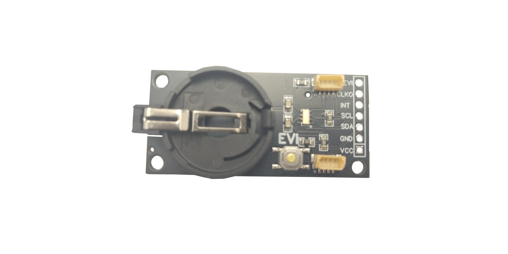
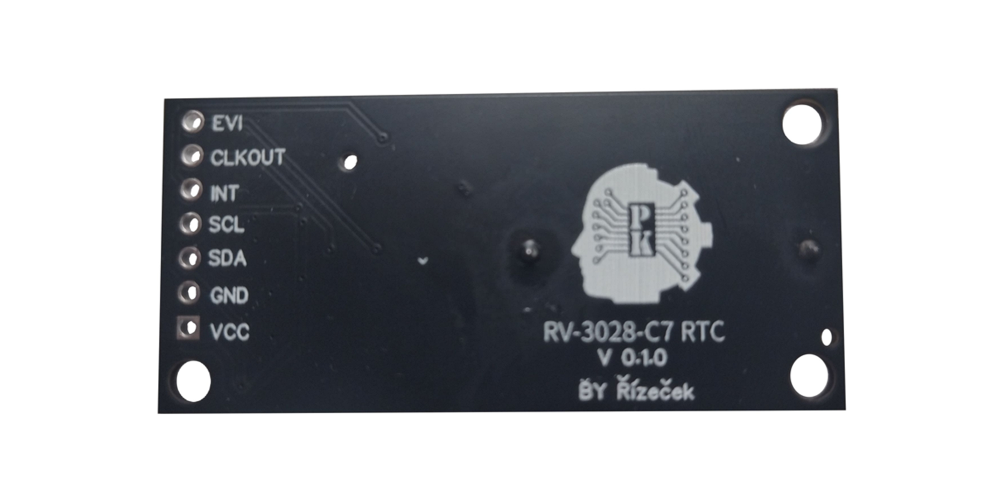
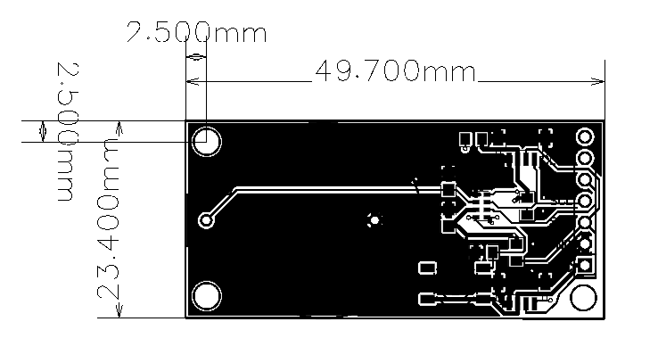

# PK-RV-3028-C7

Template for product development. Product description. You will make many photos (from 3 axes).


## 1. WHAT IS IT

The **PK-RV-3028-C7** is a precision clock built with the ultra-low-power RV-3028-C7 RTC module from Micro Crystal Switzerland. It features two Stemma QT connectors, a large battery, and a programmable event button.

## 2. WHY DID WE MAKE IT

This PBC has been forged to provide ultra precise real time clock while consuming minimal power. It's RV-3028-C7 RTC module, recognized for its low energy consumption, created with Stemma QT connectors for serial integration, a big battery for longer use, and a programmable event button for custom functions.

## 3. WHAT MAKE IT SPECIAL

1. **Stema QT connectors** : The clock's PCB includes **Stemma QT** connectors, allowing it to be easily **linked in series** with other compatible boards or shields.
2. **Big Battery** : The PCB is equipped with a large battery for extended usage, and when paired with the ultra-low power consumption of the RTC module, it can last a significantly long time.
3. **Event Button** : The PCB includes a programmable **event button**, allowing you to **customize its actions** when pressed.

## 4. TECHNICAL SPECIFICATIONS
| **Tech. Specification** | **Explanatory notes** |
|-------------------------|-----------------------|
| `Ultra-Low Power Consumption` | +Typically operates at `45 uA` at `3 V`, which is excellent for battery-operated and energy-sensitive applications|
| `Power Supply Range` |Operates between `1.2 V` and `5.5 V`, making it compatible with a wide range of systems|
| `Clock Accuracy` |Highly accurate, with a typical drift of `±1` ppm from `-40°C` to `+85°C` <br> Equivalent to about `±2.6` seconds per month without any calibration, making it one of the most precise RTCs available|
| `Temperature Compensation` |Integrated temperature compensation provides stability across a wide temperature range|
| `Backup Battery Support` |Has a backup battery input (`V_BAT`), allowing it to keep time even if the main power is disconnected|
| `Timestamp Function` |Has a feature that can capture timestamps of key events, like button presses or power interruptions, which is useful in event tracking applications|
| `I²C Interface` | Communicates through an `I²C` interface, making it easy to integrate with microcontrollers and other digital systems|
| `Alarm and Timer Functions` |Features configurable alarms and countdown timers, useful for scheduling events or triggering actions|


## 5. Source Code / EXAMPLES

[RV-3028_C7-Arduino_Library](https://github.com/constiko/RV-3028_C7-Arduino_Library)
```c++
/*
 this code was made by: Constantin Koch
if you like this library and his work, you can go support him throuth out the link on top 
*/

#include <RV-3028-C7.h>

RV3028 rtc;

//The below variables control what the date will be set to
int sec = 0;       // Sekundy (0-59)
int minute = 0;    // Minuty (0-59)
int hour = 0;      // Hodiny (0-23)
int day = 3;       // Den v týdnu (1 = Pondělí, 7 = Neděle)
int date = 5;      // Den v měsíci (1-31)
int month = 11;    // Měsíc (1-12)
int year = 2024;   // Rok (čtyřciferný formát)

// ...

void setup() {
  Serial.begin(115200);
  while (!Serial);
  Serial.println("Read/Write Time - RTC Example");

  Wire.begin(6,7);
  if (rtc.begin() == false) {
    Serial.println("Something went wrong, check wiring");
    while (1);
  }
  else
    Serial.println("RTC online!");
  delay(1000);
}

void loop() {
  //PRINT TIME
  if (rtc.updateTime() == false) {
    Serial.print("RTC failed to update");
  } else {
    String currentTime = rtc.stringTimeStamp();
    Serial.println(currentTime + "     's' = set time     '1' = 12 hours format     '2' = 24 hours format");
  }

  //SET TIME?
  if (Serial.available()) {
    switch (Serial.read()) {
      case 's':
        // Uncomment the below code to set the RTC to your own time
        if (rtc.setTime(sec, minute, hour, day, date, month, year) == false) {
          Serial.println("Something went wrong setting the time");
        }
        break;
      case '1':
        rtc.set12Hour();
        break;

      case '2':
        rtc.set24Hour();
        break;
    }
  }
}
```

### 6.1 SCHEMA


### 6.2 PCB





### 6.2 3D MODEL


## 7. WHERE TO BUY

1. [Link text Here](https://prokyber.cz)
2. [Link text Here](https://prokyber.cz)
3. [Link text Here](https://prokyber.cz)

Podpora produktu
certifikace produktu
