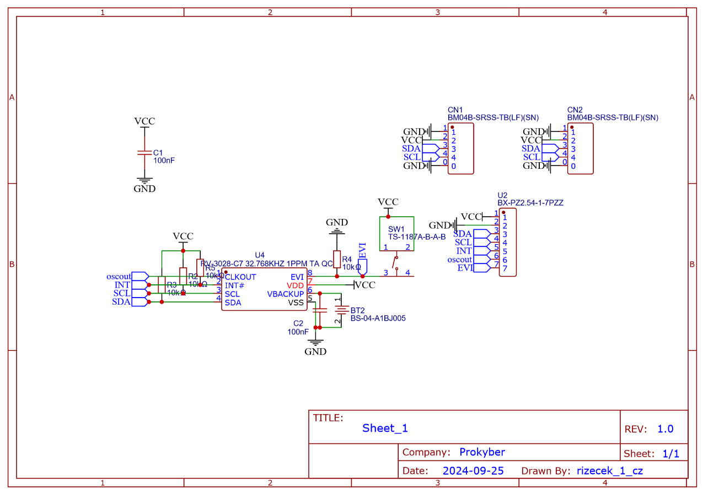

# PK-RV-3028-C7

Template for product development. Product description. You will make many photos (from 3 axes).

## 1. WHAT IS IT

The **PK-RV-3028-C7** is a precision clock built with the ultra-low-power RV-3028-C7 RTC module from Micro Crystal Switzerland. It features two Stemma QT connectors, a large battery, and a programmable event button.

## 2. WHY DID WE MAKE IT

This PBC has been forged to provide ultra precise real time clock while consuming minimal power. It's RV-3028-C7 RTC module, recognized for its low energy consumption, created with Stemma QT connectors for serial integration, a big battery for longer use, and a programmable event button for custom functions.

## 3. WHAT MAKE IT SPECIAL

1. **Stema QT connectors** : The clock's PCB includes **Stemma QT** connectors, allowing it to be easily **linked in series** with other compatible boards or shields.
2. **Big Battery** : The PCB is equipped with a large battery for extended usage, and when paired with the ultra-low power consumption of the RTC module, it can last a significantly long time.
3. **Event Button** : The PCB includes a programmable **event button**, allowing you to **customize its actions** when pressed.

## 4. TECHNICAL SPECIFICATIONS
| **Tech. Specification** | **Explanatory notes** |
|-------------------------|-----------------------|
| `Ultra-Low Power Consumption` | +Typically operates at `45 uA` at `3 V`, which is excellent for battery-operated and energy-sensitive applications|
| `Power Supply Range` |Operates between `1.2 V` and `5.5 V`, making it compatible with a wide range of systems|
| `Clock Accuracy` |Highly accurate, with a typical drift of `±1` ppm from `-40°C` to `+85°C`   Equivalent to about `±2.6` seconds per month without any calibration, making it one of the most precise RTCs available|
| `Temperature Compensation` |Integrated temperature compensation provides stability across a wide temperature range|
| `Backup Battery Support` |Has a backup battery input (`V_BAT`), allowing it to keep time even if the main power is disconnected|
| `Timestamp Function` |Has a feature that can capture timestamps of key events, like button presses or power interruptions, which is useful in event tracking applications|
| `I²C Interface` | Communicates through an `I²C` interface, making it easy to integrate with microcontrollers and other digital systems|
| `Alarm and Timer Functions` |Features configurable alarms and countdown timers, useful for scheduling events or triggering actions|

## 5. Source Code / EXAMPLES

...

## 6. Documentation

PINOUT is most important.

### 6.1 SCHEMA

Every image is in specific folder.

### 6.2 PCB

### 6.2 3D MODEL

Enclosures:

1. [Link on thingiverse](https://www.thingiverse.com/)
1. [Link on thingiverse](https://www.thingiverse.com/)

## 7. WHERE TO BUY

1. [Link text Here](https://prokyber.cz)
2. [Link text Here](https://prokyber.cz)
3. [Link text Here](https://prokyber.cz)

Podpora produktu
certifikace produktu
